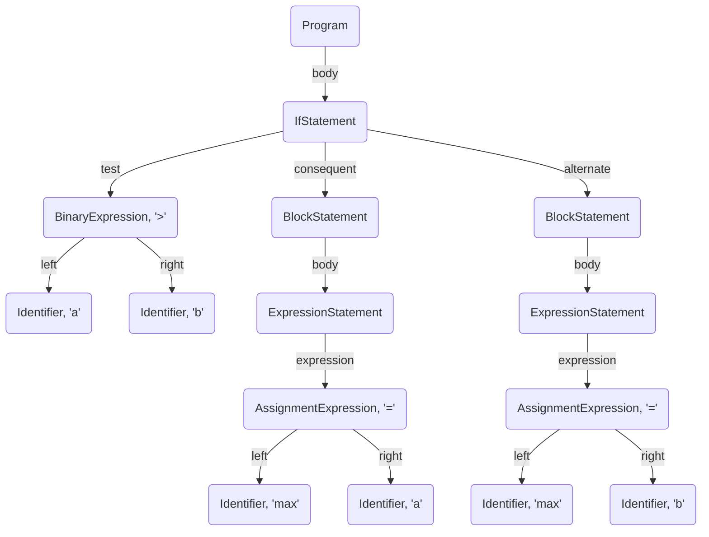
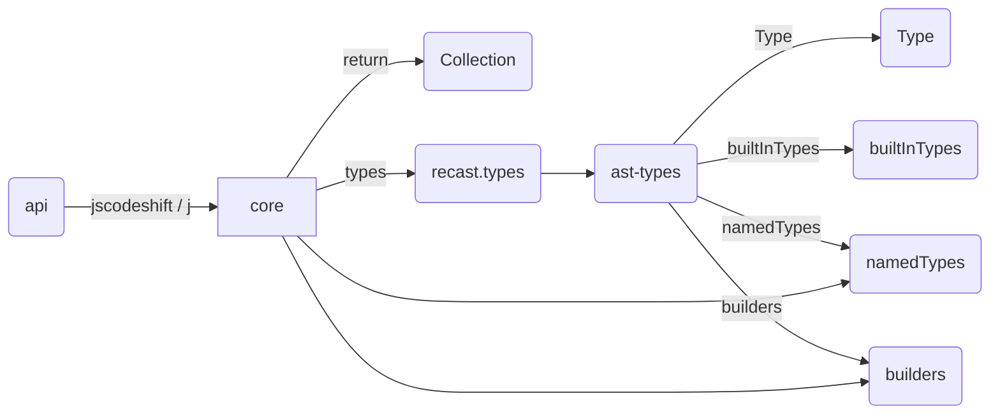

个人认为 jscodeshift 的 [官方文档](https://github.com/facebook/jscodeshift/wiki) 对新手不是特别的友好，所以写下了这篇文章，希望能给想要上手 jscodeshift 的同学一些方便。

我会通过一个简单的示例来介绍 jscodeshift 的使用方法，并对 jscodeshift 的一些实现进行一个简单的介绍。本文使用的 jscodeshift 为 **0.3.32** 版。

<!--more-->

jscodeshift 是一个由 Facebook 出品的 JavaScript codemod 工具集。codemod 的官方定义为：

> codemod is a tool/library to assist you with large-scale codebase refactors that can be partially automated but still require human oversight and occasional intervention.

简单的说，就是一种基于抽象语法树（AST）的代码自动化重构工具。

## 抽象语法树（AST）

抽象语法树（以下简称 AST）是将程序 token 解析出来，组织成与程序结构对应的树状结构表示，例如代码段：


if (a > b) {
  return a;
} else {
  return b;
}


转化为 AST 就会得到类似下面的结构：

可以看到它的跟节点为 Program 节点，if 语句 被识别成了 IfStatement 节点，这个节点的三个属性 `test`，`consequent`，`alternate` 分别对应了 if 语句的判断条件，判断结果 true 的语句和判断结果为 false 的语句。这种结构很精确的表现了代码的逻辑，通过对抽象语法树的节点进行修改，然后再将新的语法书转化为源码字符就可以达到代码自动化重构的目的，所以，jscodeshift 也可以看作是一个语法树的查找、遍历和修改的库。

## jscodeshift 简介

首先来看一个简单的例子：

在 React 15.5.0 之后 `React.createClass` 就不推荐使用了，官方建议使用 `create-react-class` 模块来代替该 API。考虑到这个替换并不是特别复杂，所以我们决定做一个工具来自动化的替换 `React.createClass`。

首先写一个原始代码：


var React = require('React');

var Counter = React.createClass({
  render() {
    return <h1>Hello, {this.props.name}</h1>;
  }
});


然后再写出期望改动后的代码：


var React = require('React');
//var createReactClass = require('create-react-class');

var Counter = createReactClass({
  render() {
    return <h1>Hello, {this.props.name}</h1>;
  }
});


在 [astexplorer](https://astexplorer.net/) 网站上对比这两段代码的 AST，观察出改动后的代码相比原始代码的改动。

可以看到这两段代码的语法书不同点在 CallExpression 的 `callee` 值，我们只需替换 `callee` 原本的 MemberExpression 节点到新建的 Identifier 节点就行了。

整个过程简单来说就是找到需要替换的节点，修改节点，使用新的语法树生成源码。其代码实现如下：


const transformer = (file, api) => {
  const j = api.jscodeshift;
  const root = j(file.source);
  root
    .find(j.MemberExpression)
    .filter(path => {
      const cObject = path.node.object;
      const cProperty = path.node.property;
      if (cObject, cProperty) {
        return cObject.type === 'Identifier' &&
          cObject.name === 'React' &&
          cProperty.type === 'Identifier' &&
          cProperty.name === 'createClass';
      } else {
        return false;
      }
    })
    .forEach(path => {
      j(path).replaceWith(j.identifier('createReactClass'));
    });
  return root.toSource({ quote: 'single' });
}

module.exports = transformer;


首先 `api.jscodeshift` 是 jscodeshift 提供的一个 Collection 构造函数，该函数对象上绑定了 ast-types 的 `namedTypes` 和 `builders` （见下图）。其中 `namedTypes` 为大写字母开头，例如代码中的 `j.MemberExpression` ，它就是一个 Type 对象。向该构造函数提供源码字符串或 AST 就可以通过 new 关键字构造出一个 Collection 对象，例如上面示例的第 3 行。`builders` 以小写字母开头，例如代码中的 `j.identifier`，它能根据传入的值返回新建的 AST 节点。

其中 AST 节点的类型是固定的，由于没有找到比较方便的 ast-types 文档，这里推荐 [babe-types](https://babeljs.io/docs/core-packages/babel-types/) 的文档。它介绍了各种 AST 节点的 builder 函数，方便好用。将各 builder 函数名首字母大写即可得到对应的 Type 名 ，不过要注意的是因为 jscodeshift 使用的是 ast-types，和 babe-types 还是有一些区别。babe-types 文档中以 “jsx” 开头的 builder 函数在 ast-types 中的这几个字母都是小写的，所以在使用的时候转化下就好了，例如 babe-types 文档中的的 “jSXAttribute” 对应的是 “jsxAttribute”。

ast-types 的类型定义在其源码的 def 文件夹中，通过 Type 类的 def 方法定义类型的名称和 builder 函数的参数类型，例如：


def("IfStatement")
  .bases("Statement")
  .build("test", "consequent", "alternate")
  .field("test", def("Expression"))
  .field("consequent", def("Statement"))
  .field("alternate", or(def("Statement"), null), defaults["null"]);


这段代码定义了“IfStatement”类型，它的 builder 函数包含 3 个参数：test，consequent 和 alternate。其中 test 为“Expression”类型，consequent 为“Statement”类型，alternate 为“Statement”类型或 null，默认值为 null。

类型的 builder 函数名由 ast-types/lib/types.js 中的 getBuilderName 函数得出，其代码如下：


function getBuilderName(typeName) {
  return typeName.replace(/^[A-Z]+/, function (upperCasePrefix) {
    var len = upperCasePrefix.length;
    switch (len) {
      case 0: return "";
        // If there's only one initial capital letter, just lower-case it.
      case 1: return upperCasePrefix.toLowerCase();
      default:
        // If there's more than one initial capital letter, lower-case
        // all but the last one, so that XMLDefaultDeclaration (for
        // example) becomes xmlDefaultDeclaration.
        return upperCasePrefix.slice(
          0, len - 1).toLowerCase() +
          upperCasePrefix.charAt(len - 1);
    }
  });
}


可以看到，当类型名前有多个大写字母时，会将最后一个大写字母保留，其他字母都变成小写，所以就有上文所说 builder 函数名的不同。

ast-types 的 NodePath 类代表了 AST 的一个节点。通过 NodePath 类的 node 属性可以得到以该节点为根节点的子树结构，可以很方便的获得该节点及其子树节点的各种值。

Collection 类是 jscodeshift 对 ast-types 节点的封装。它提供了 AST 的遍历、查找和操作的方法，这些方法的都以一个新的 Collection 对象作为返回值，这样能方便的进行链式调用，让代码显得更简洁。该类的 `__paths` 属性是一个 NodePath 对象的数组，包含了当前操作的 AST 树节点的集合。例如上面代码中 root 的 `__paths` 属性是整个源码树的根节点（数组长度为 1），`find(j.MemberExpression)` 返回的就是 root AST 中类型为 MemberExpression 的所有节点的数组。

关于 Collection 的介绍可以参考[官方文档](https://github.com/facebook/jscodeshift/wiki/jscodeshift-Documentation)，这里我把比较常用的方法归纳了一下（见下表）。

| 类别   | api                                      |
| ---- | ---------------------------------------- |
| 查找   | find, filter                             |
| 修改   | replaceWith,  insertBefore, insertAfter, remove |
| 其他   | forEach, map, size, at                   |

find 和 filter 主要用于查找和定位我们需要修改的节点。find 方法接受两个参数：type 和 option（可选）。type 即是上文所说的 Type 对象，option 是附加的过滤条件，例如 `root.find(j.Identifier, { name: 'get' })` 就表示找到名称为“get”的 Identifier 节点。当然这只能去做一些简单的过滤，对于复杂的过滤就该 filter 登场了。

filter 方法其实就是调用了 Collection 类 `__paths` 属性的值（一个 NodePath 对象数组）的 filter 方法，该方法接受一个布尔返回值的回调函数，这个回调函数的参数就是遍历的 NodePath 对象。例如上面的代码，先通过 `path.node` 得到该节点及子节点的数据结构，取 `object` 和 `property` 的值，然后判断它们的 `type` 和 `name` 是否为我们期望的值，从而定位我们想要修改的节点。

和 filter 一样，forEach 和 map 也对应 NodePath 对象数组的同名方法，例如上面代码中的这几行：


.forEach(path => {
  j(path).replaceWith(j.identifier('createReactClass'));
});


将 filter 所得的结果进行一个遍历，对每个节点执行 replaceWith 进行替换，这样就把“createClass” 替换成了“createReactClass”。

最后通过调用 `root.toSource` 将整个 AST 转化为源码并返回，然后就可以通过 jscodeshift 命令来运行转化源码了。