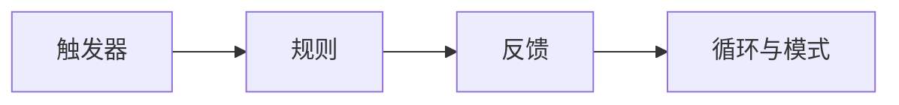
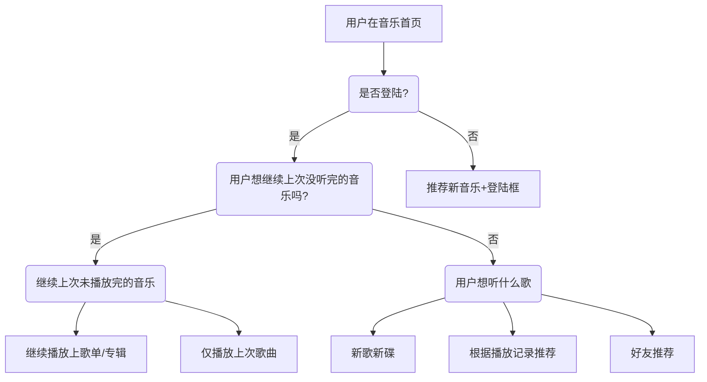
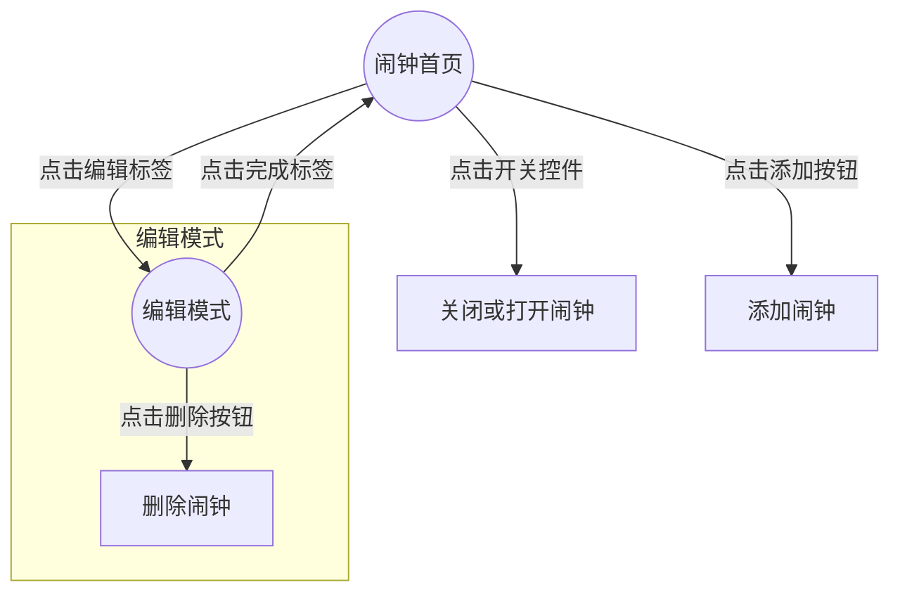

## 微交互的结构

1. 触发器：用户想要做什么？
2. 规则：会触发什么？
3. 反馈：怎样能让用户理解规则？
4. 循环与模式：元规则。

这四个步骤组成了微交互的结构，其实所有交互都是在这个结构形态上产生的。只是复杂程度不同。

<!--more-->

> My heart belongs to the details. I actually always found them to be more important than the big picture. Nothing works without details. They are everything, the baseline of quality.
> -- Dieter Rams

### 触发器

#### 触发器的分类

#### 手动触发器

##### 构成

手动触发器包含三个部分：控件、控件状态、文本或图示标签（标识）。例如，商场的门（控件），只能从外面推开（状态），那么门外面就有“推”的标志（标识）。

##### 控件的状态

- 默认状态
- 活动状态
- 悬停状态
- 翻转状态
- 鼠标单击/手指轻击/进行中
- 切换状态（模式）
- 设置状态（模式）

#### 系统触发器

系统触发器无需用户介入，只要满足条件（一个或多个）就会自动触发。

系统触发器启动的常见条件：

- 错误（没有网络）
- 位置（到达电影院自动静音）
- 收到数据（收到邮件）
- 内部数据（过一定时间屏幕亮度自动降低）
- 其他微交互（向导式页面：第一个微交互的结束触发第二个微交互，这是一种特殊的引导式交互非，一般情况不建议使用）
- 其他人（回应聊天，发表照片或信息，申请成为好友）

虽然用户不必手动启动这些触发器，但最好是（比如在“设置”里）提供选项让用户能够调整它们。系统启动的每个触发器都应该有手动管理及禁用它们的选项。理想情况下，应该在微交互已经触发的时候给出这些选项（“不再显示这些提示”），至少有相应的设置。

#### 触发器的规则

##### 规则一：触发器必须让用户在使用情境下认出来其是触发器。

##### 规则二：保证触发器每次都触发相同的动作。

不管在那个页面，快速按两下 iPhone 的主屏幕按钮都会打开多任务页面。

##### 规则三：提前展示数据。

Chorme 在下载时能直观的从图标上看到下载的进度：

##### 规则四：不要破坏视觉使用情境。

如果触发器看起来像按钮，那它就应该像按钮一样能按下去。

##### 规则五：用得越多的触发器越要引人注目。

> 多数人经常要用的微交互，应该最引人注目。 少数人有时会用的微交互， 应该容易注意到。 极少数人不常用的微交互， 应该通过搜索找。
> -- *Scott Berkun “The Myth of Discoverability”*

人类注意周围环境中事物的情况分两种。第一种，周围的事物如果正在**移动**或**发出了声响**，会让人不自觉地注意它们。

人类关注事物的第二种情况是**主动搜寻**，即有目的地寻找。

最引人注目的触发器依次是：

- 移动的物体，比如脉动图标；
- 带使用情境和标签的物体，比如带标签的按钮；
  
  （中间的“BUTTON”就是标签）

- 带标签的物体，比如带标签的图标；
- 只有一个物体，比如图标；
- 只有一个标签，比如菜单项；
- 什么也没有——不可见的触发器。

不可见触发器应该容易猜到，或者说，在理想情况下可以让用户在执行其他动作时偶然发现。

##### 规则六：不要引起用户对使用情境的错觉。

如果触发器看起来像按钮，那它就应该表现的和按钮一样。

这条和第四条有点差别，比如：

第四条：这有一扇滑动门，进屋需要“向右拉门”。但如果门上贴着“推”，就是破坏视觉使用情境。

第六条：这有一扇滑动门，进屋需要“向右拉门”。但如果门上有个“→”，用户误认为是自动门，就是引起用户对使用情景的错觉。

规则六重点在于误解，规则四重点在于正确性。

##### 规则七：仅在触发器本身无法提供相应信息的情况下才使用标签。

对某些触发器而言，标签也是非常重要的部分。标签可以是微交互的名称（例如菜单项或微软功能区的名称），也可以作为状态指示器，比如拨号盘每个止动装置的名称。

标签的作用显而易见：我是不是在做自己想做的事？标签说明动作，帮助消除歧义。不过，鉴于标签会增添触发器的复杂性，需要额外的关注和思考，因此若非担心引发歧义，不要使用标签。

### 规则

微交互的规则决定了微交互能怎么用。而创建规则的核心，就是创建一个围绕微交互如何运作的简单的非技术性心智模型。

设计规则可以从目标着手。

#### 设计规则

设计规则最重要的是确定目标，目标因该容易理解，而且能是够完成的。

设计规则最简单的方式，就是一开始把你能想到的规则大体上记录下来。

想象一个场景：音乐播放器。它的目标就是**成功播放喜欢的音乐**。

#### 生成规则

将上面设计的规则细化，考虑的更全面，就能生成一套详细的规则。在这个阶段，**逻辑关系图**非常有用。

#### 名词和动词

把微交互想象成一句话。这句话中的名词代表用户要采取的动作，名词代表辅助实现该动作的对象。例如，通过滑动条可以调节音量大小。动词就是用户可以做什么（调节音量大小），名词就是通过什么来调节（滑动条）。

#### 屏幕与状态

“一屏一个问题”，这种引导式交互非常特殊，对于那些只需要走一遍的流程，它应该是最佳方案。但是，大多数交互流程，还是避免使用这种方案，一旦页面上有“状态变化”，那么不用加载新页面，用户就可以马上了解目前状态，并作出相应操作。

例如，图片预览，点击一个图片在原有的页面出现预览层而不是打开一个新的图片页面。

#### 不要从零开始

已有数据的充分利用。比如，上面播放用户喜欢的音乐，如果当前没有再播放的音乐，可以根据播放记录或者好友来推荐音乐。

#### 理解复杂性

> 所有活动都有内在的复杂性，超过了某个临界点，简化是不可能的，这辈子都不可能的。
> -- 特斯勒复杂性守恒定律

目前为止，全世界勤劳勇敢的交互设计师总结出了十八条交互定律，**特斯勒定律**是其中一条。既然“简化是不可能的”那么就只能在交互上尽量的简化系统的复杂度。例如，模式，适当的默认值，甚至一些自动化工作（AI 技术也许是简化系统复杂度的良药），但是这些默认值，自动化的结果一定要让用户可以修改，毕竟系统所给的结果不总是用户想要的。

1. 找出最核心的复杂性出现在什么地方。（什么地方最容易出错）
2. 确定用户掌握哪一部分。（用户可以控制哪些内容）
3. 用户何时介入。（用户在什么时候可以去修改这些内容）

例如，线上开通股票账户，最核心，最容易出错的地方是身份证号码，用户掌握着身份证号码的输入权限，同时也可以拍照让系统自动识别并填写身份证号，一旦识别错误，用户可以进行手动修改。

通俗来讲就是把人觉得干起来非常耗时耗力的事尽量交给机器做，但是也要向用户提供手动控制的入口。

### 反馈

- 什么事情已经开始了；
- 用户刚刚做了什么事；
- 哪些过程已经开始了；
- 哪些过程已经结束了；
- 哪些过程正在进行中；
- 用户不能干什么。

#### 反馈的规则

##### 规则一：别让反馈给用户造成压力。

如何判断？可以问自己：怎么通过最少的反馈传达同样的信息。

在以下情况下，应该给出反馈。

- 手动启动触发器之后或者手动调整规则之后/期间
- 微交互（或周边功能）的状态因为系统启动触发器而发生显著变化时。例如，系统检查到新邮件后发出通知。
- 用户突破（或超越）了规则时。例如，表单的验证。
- 系统不能执行命令时。例如，飞行模式无法发送短信时。
- 在关键过程特别是需要花费较长时间的操作中显示进度。例如，上传或下载。

##### 规则二：最好的反馈永远不会高深莫测。

始终向用户传递有用的消息，并且反馈与导致反馈的动作之间一定存在某种深刻的联系。

##### 规则三：用最少的反馈传达最丰富的消息。

信息越重要，反馈就要越明显。

##### 规则四：使用被人忽视的东西作为传达信息的手段。

UI 中这些被忽视的部分——滚动条、光标、进度条、提示条/悬浮层等，都可以用于反馈信息。如此一来，不用在屏幕上显示新东西，照样能传达出比平时更多的信息。例如，鼠标移动到一个被禁用的按钮时， 指针变成禁止的样式。

#### 反馈的方法

##### 视觉方法

##### 听觉方法

##### 触觉方法

#### 反馈的规则

##### 环境的变化

反馈会根据环境的变化而变化吗？

##### 持续时间

反馈要持续多长时间？如何停止？

##### 重复次数

反馈重复吗？多长时间重复一次？

##### 强烈程度

效果有多亮、多快、多剧烈？是用于烘托气氛还是为了引人注意？强烈程度随时间加大，还是保持不变？

### 循环与模式

#### 模式

模式是规则的一个分支，对于为交互来说，模式应该尽可能少用。大多数微交互都应该没有模式，但有时候模式也是必要的。

模式的最主要的目的是**执行一种不常见的动作**，这种动作可能会妨碍微交互达成其主要目的。常见的模式是“设置模式“。

##### 弹簧模式

只有在用户按下键或按住鼠标不放的情况下激活。用户一停止上诉动作，模式就会消失。

例如按住键盘上的 `Shift` 键打开“大写模式”。

##### 一次性模式

一次性模式指的是在用户发起模式时，模式持续的时间与动作执行时间相等，动作结束，模式就结束。

例如 iOS 中双击文本会调出其剪贴功能（“文本编辑模式”），改功能在选择一个命令后消失。

### 循环

循环（在微交互的语境下）就是不断重复的一段时间，通常用于设定持续时间。

循环由规则（直接或间接地）指明。“每 30 秒获取一次数据” 或 “运行 3 分钟，然后停止” 或 “每 10 天发送一次提醒” 都表明微交互中有循环。

#### 循环的分类

##### 计数（for）循环

重复既定次数的循环。比如，在显示错误消息前，检查 10 次是否有网络连接。

##### 条件（while）循环

在满足条件的情况下反复执行的循环。如果条件变化或结束，则循环停止。如果有网络连接，则每分钟检查一次 Twitter 的新消息。

##### 集合循环

与计数循环类似，这种循环会遍历集合中的每个值，然后停止。例子：对每封未读邮件，给未读计数器加 1。

##### 无穷循环

循环开始后，除非出错或被人强制停止，否则永远不会结束。

***

##### 开放循环

开放循环不相应反馈，他们执行完就结束

##### 封闭循环

封闭循环具有内置反馈机制，因而可以自动调整。比如，汽车开动后，封闭循环可以自动检查发动机噪音，据此调整汽车的音响。